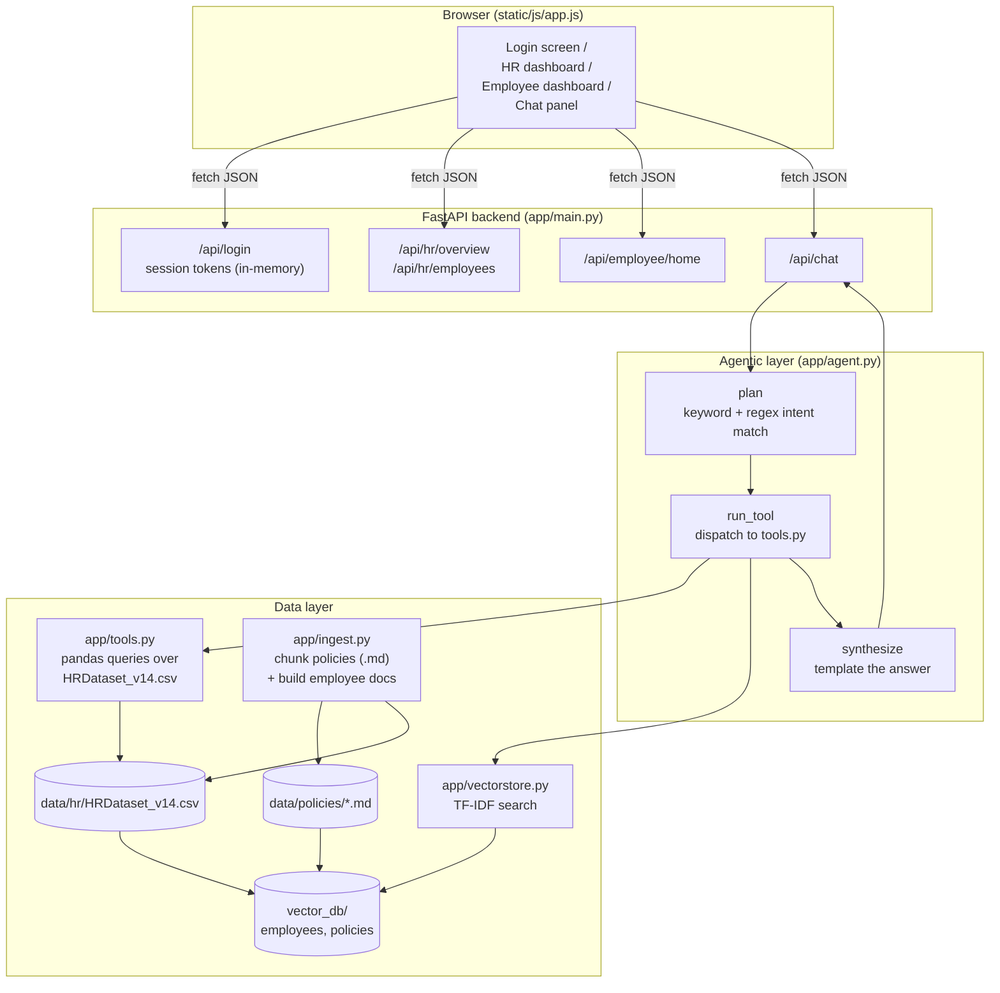

# AIONOS People OS — Agentic RAG Portal

An internal HR/employee self-service portal for **AIONOS**, built around a single chat assistant
that both HR and employees can use — but where the assistant's access to data is scoped by role.
HR's assistant can query the full employee file and workforce analytics; an employee's assistant
can only see company policies and their own profile. Same UI, same chat box, different knowledge
boundary, enforced on the server.

## Table of contents

- [What "agentic RAG" means here](#what-agentic-rag-means-here)
- [Architecture](#architecture)
- [Use case](#use-case)
- [Functionality](#functionality)
- [Data model](#data-model)
- [Running it](#running-it)
- [Demo logins](#demo-logins)
- [Project layout](#project-layout)
- [Known limitations](#known-limitations)

---

## What "agentic RAG" means here

It's a **deterministic agent** that follows the classic plan → act → observe → synthesize loop using
hand-written rules instead of a language model doing the reasoning:

1. **Plan** (`app/agent.py::plan`) — parses the question for keywords, EmpIDs, department names,
   and performance labels, and decides which of the available **tools** to call. A question can
   trigger more than one tool (e.g. "PIP employees in IT/IS" plans a `filter_employees` call *and*
   a policy search).
2. **Act** (`app/agent.py::run_tool`) — executes the planned tools. Some hit the **TF-IDF vector
   store** for semantic-ish search over policy text or employee records; others run direct
   **pandas queries** over the HR dataset for structured lookups (workforce stats, promotion
   candidates, a specific EmpID, a computed bonus estimate, a leave-entitlement calculation).
3. **Observe** — every tool call is logged as a trace entry: which tool ran, with what arguments,
   and whether it was **blocked** by the role boundary (visible in the UI as "Blocked: tool_name").
4. **Synthesize** (`app/agent.py::synthesize`) — turns the structured tool outputs into a plain-text
   answer using response templates, tailored to which tools actually returned data.

The retrieval layer (`app/embeddings.py`, `app/vectorstore.py`) is a small, dependency-free
TF-IDF implementation: documents are tokenized into unigrams + bigrams, weighted by TF-IDF, and
compared to the query with a normalized dot product (cosine similarity). No external embedding
API, no vector DB service — the whole index is a NumPy array persisted under `vector_db/`.

## Architecture



**Request flow for a chat message:**

`POST /api/chat` → `main.chat()` authenticates the session token → `agent.answer(message, user)`
→ `plan()` picks tools based on the question and the caller's role → each planned tool runs
against either the pandas HR frame or the TF-IDF store → `synthesize()` assembles the final text
→ response includes the answer, a tool-call trace, and citations (source policy sections /
employee records used).

**Frontend:** a single vanilla-JS SPA (`static/js/app.js`, no build step, no framework) that
renders three views — the login-gated home screen, the HR dashboard, and the employee dashboard —
plus a shared chat panel, all driven by one `state` object and a `render()` function.

**Backend:** FastAPI (`app/main.py`) with simple bearer-token sessions held in an in-memory dict
(`SESSIONS`) — not JWT, not persisted, reset on server restart. On startup, it builds the vector
stores if they don't exist yet (`ingest()`), otherwise loads the persisted ones.

## Use case

AIONOS wants one internal "People OS" portal instead of separate HR software and an employee
intranet. The pitch this project demonstrates:

- **One assistant, two knowledge scopes.** Both audiences ask questions in the same chat box, but
  the *same question* can yield a different (and correctly scoped) answer depending on who's
  asking — an employee asking about "absences" gets their own record; HR asking the same gets a
  filterable view across the whole company.
- **Confidential data stays confidential by construction**, not by UI convention. The role check
  happens in `agent.answer()` before a tool ever runs, so even a modified frontend request can't
  reach HR-only tools with an employee session token.
- **A worked example of retrieval-augmented answers without an LLM dependency** — useful as a
  cheap, offline-friendly baseline or teaching example before swapping in a real LLM for
  synthesis.

## Functionality

**Authentication**
- Role-selecting login (`hr` or `employee`), demo credentials, session token returned and stored
  in `localStorage`.
- Employee login resolves by EmpID or a fuzzy last-name match against the HR file; only active
  employees can log in.

**HR dashboard**
- Workforce snapshot: headcount, active count, attrition rate, average salary (overall and
  active-only), department breakdown, performance mix.
- Promotion candidates (Active, Fully Meets/Exceeds, engagement ≥ 3.5, absences ≤ 12), ranked by
  a composite fit score.
- PIP list and high-absence list, department-filterable directory.

**Employee dashboard**
- Personal profile card (position, department, manager, performance, engagement, salary).
- Policy-based bonus estimate (target % by role, performance multiplier, absence penalty).
- Leave summary (21 privilege / 8 casual / 12 sick days) and current unplanned-absence count.
- Quick-reference policy blurbs (leave, bonus, raises, promotions, partners).

**Chat assistant (both roles)**
- Suggested prompt chips tailored to the role.
- Tool-call trace shown inline (which tools ran or were blocked, for transparency/debugging).
- Citations listing which policy section or employee record backed the answer, with a relevance
  score.
- Role-scoped tools:

  | Tool | HR | Employee |
  | --- | :---: | :---: |
  | `search_policies` | ✅ | ✅ |
  | `my_profile` / `leave_status` | — | ✅ (own record only) |
  | `get_employee` / `filter_employees` / `search_employees` | ✅ | ❌ blocked |
  | `workforce_stats` / `promotion_candidates` | ✅ | ❌ blocked |

## Data model

- **`data/hr/HRDataset_v14.csv`** — 311 employee records (name, EmpID, position, department,
  manager, salary, performance score, engagement/satisfaction survey results, absences, hire/term
  dates, demographics). Ingested as one text document per row, tagged `audience: hr`.
- **`data/policies/*.md`** — five policy documents (leave, bonus, salary raise, promotion,
  partners). Ingested by splitting on `##` headings, so each retrievable chunk is one policy
  section, tagged `audience: all`.
- **`vector_db/{employees,policies}/`** — persisted TF-IDF vectors (`vectors.npy`), the source
  chunks (`chunks.json`), and the fitted vocabulary/IDF weights (`embedder.json`). Rebuilt
  automatically if missing, or on demand via `POST /api/ingest` (HR-only).

## Running it

```bash
cd GATE
python -m pip install -r requirements.txt
python -m uvicorn app.main:app --host 127.0.0.1 --port 8000 --reload
```

Open **http://127.0.0.1:8000**. On first run the app chunks the policy docs and HR CSV, builds
the TF-IDF index, and writes it to `vector_db/`; subsequent runs load the persisted index.

## Demo logins

| Role | Username | Password |
| --- | --- | --- |
| HR | `hr` | `aionos2026` |
| Employee | EmpID `10002` (Linda Anderson), or any other **active** EmpID / last name from the CSV | `aionos2026` |

## Project layout

```
GATE/
├── app/
│   ├── main.py          FastAPI app: auth, HR/employee endpoints, chat endpoint
│   ├── agent.py          plan / run_tool / synthesize — the agentic loop
│   ├── tools.py           pandas-backed HR queries + bonus/leave calculations
│   ├── vectorstore.py    TF-IDF vector store (build, persist, search)
│   ├── embeddings.py     the TF-IDF embedder itself
│   └── ingest.py          chunks policy markdown + builds employee documents
├── data/
│   ├── hr/HRDataset_v14.csv
│   └── policies/*.md
├── vector_db/            persisted TF-IDF index (generated, not hand-edited)
├── static/
│   ├── index.html
│   ├── css/styles.css
│   └── js/app.js         the whole frontend (no build step)
└── requirements.txt
```

## Known limitations

- **No real LLM.** Answers are template-assembled from tool outputs, not generated text — great
  for predictable, auditable responses; limited when a question doesn't match any planned intent.
- **In-memory sessions.** Restarting the server logs everyone out; there's no real auth (any
  password in this demo is a hardcoded shared secret).
- **TF-IDF retrieval**, not a learned embedding model — good for exact/keyword-adjacent matches
  over a small, well-structured document set like this one; it won't handle loosely-phrased or
  paraphrased questions as gracefully as a real embedding model would.
- **Leave balances are policy-level, not per-employee.** The HR dataset only tracks a single
  "Absences" count, not leave taken by type, so exact day-by-day leave balances aren't computable
  from this data — the assistant is upfront about that rather than guessing.
